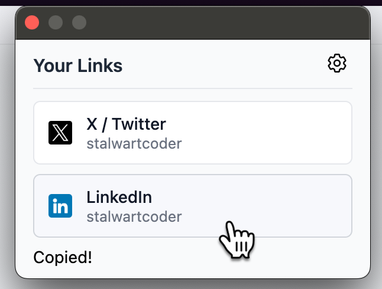
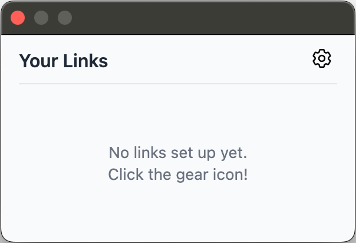
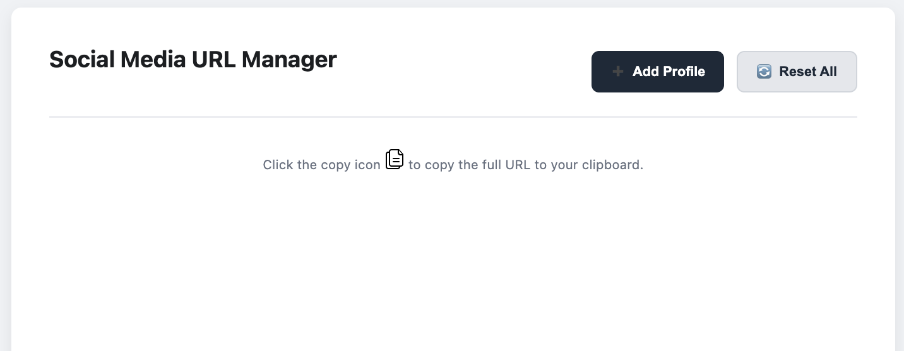

# ClipLinks

Tired of hunting for your social media profile URLs or personal website links every time you need to share them? **ClipLinks** is a simple, fast, and privacy-focused browser extension that keeps all your important links just a click away. Configure once, copy instantly!

Perfect for developers, designers, content creators, job seekers, or anyone who frequently shares their online presence.

## Features

*   **One-Click Copy:** Click any configured profile in the popup to instantly copy the full URL to your clipboard.
*   **Clean Popup UI:** Displays your links clearly with platform icons and your chosen display text/username.
*   **Easy Configuration:** Add, edit, and delete profiles via a straightforward Settings page.
*   **Lightweight & Fast:** Designed to be minimal and responsive.

## Installation

Since this extension isn't on the official browser web stores (yet!), you need to load it manually as an "unpacked extension":

1.  **Download:**
    *   Go to the [**Releases** page](https://github.com/YOUR_USERNAME/ClipLinks/releases) (Replace `YOUR_USERNAME` with your actual GitHub username) and download the latest `.zip` file (e.g., `cliplinks-v1.0.0.zip`).
    *   **OR**, if you prefer, [clone or download](https://github.com/YOUR_USERNAME/ClipLinks/archive/refs/heads/main.zip) this repository's `main` branch.
2.  **Unzip:** Extract the downloaded `.zip` file into a dedicated folder on your computer. You should have a folder containing `manifest.json`, `popup.html`, `icons/`, etc.
3.  **Open Browser Extensions:**
    *   **Chrome/Brave:** Type `chrome://extensions` in your address bar and press Enter.
    *   **Edge:** Type `edge://extensions` in your address bar and press Enter.
4.  **Enable Developer Mode:** Find the "Developer mode" toggle (usually in the top-right corner) and switch it **ON**.
5.  **Load Unpacked:**
    *   Click the "Load unpacked" button that appears.
    *   Navigate to and select the **folder** where you extracted the extension files (the folder that directly contains the `manifest.json` file).
6.  **Done!** The ClipLinks icon should now appear in your browser's toolbar. You might need to click the puzzle piece icon (🧩) to pin it.

## Usage

1.  **Click the ClipLinks icon** in your browser toolbar.
2.  A popup will appear listing your configured profiles.
3.  **Click on any profile entry** in the list.
4.  The full URL associated with that profile will be copied to your clipboard. You'll see a "Copied!" confirmation message at the bottom of the popup.
5.  Click the **gear icon (⚙️)** in the top-right of the popup to open the Settings page.

## Configuration

Manage your links via the Settings page:

1.  **Access Settings:**
    *   Click the gear icon (⚙️) in the popup.
    *   **OR**, right-click the ClipLinks extension icon in your toolbar and select "Options".
2.  **Add Profiles:**
    *   Click the "+ Add Profile" button.
    *   A modal window will appear.
    *   Select the `Platform` (e.g., LinkedIn, GitHub, Custom).
    *   If "Custom" is selected, enter a `Custom Platform Name` (e.g., "Blog").
    *   Enter the `Username / Display Text` you want to see in the popup (e.g., "stalwartcoder").
    *   Enter the complete `Full URL` that should be copied (e.g., `https://linkedin.com/in/stalwartcoder`).
    *   Click "Add Profile" (or "Save Changes" if editing).
3.  **Manage Existing Profiles:**
    *   Each entry in the Settings list has action icons on the right:
        *   **Copy (❐):** Copies the Full URL.
        *   **Edit (✎):** Opens the modal to modify the entry.
        *   **Delete (🗑):** Removes the profile entry (confirmation required).
4.  **Reset All:**
    *   Click the "Reset All" button to remove **all** saved profiles permanently (confirmation required).

## Development

Interested in improving ClipLinks?

1.  Clone this repository: `git clone https://github.com/YOUR_USERNAME/ClipLinks.git`
2.  Load the cloned folder as an unpacked extension (see Installation steps).
3.  Make your code changes.
4.  After saving changes, go back to `chrome://extensions` (or `edge://extensions`) and click the "Reload" button (🔄) for the ClipLinks extension.
5.  Test your changes by opening the popup or options page.

## Contributing

Contributions, issues, and feature requests are welcome! Feel free to check [issues page](https://github.com/abhishekmishragithub/cliplinks/issues). If you'd like to contribute code, please feel free to fork the repository and submit a pull request.

## License

This project is licensed under the MIT License - see the [LICENSE](LICENSE) file for details.
